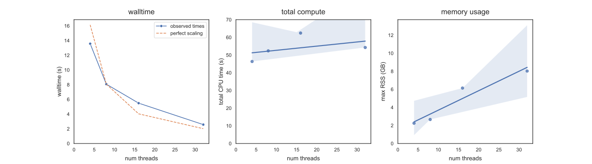
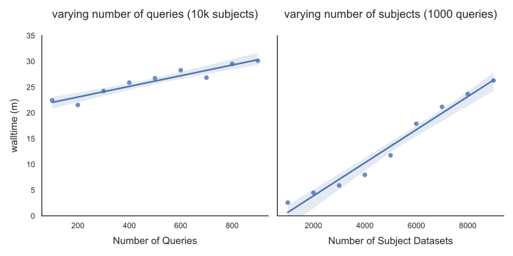

## Methods {.page_break_before}

<!-- *The Methods should include a subsection on Implementation describing
 how the tool works and any relevant technical details required for
 implementation; and a subsection on Operation, which should include
 the minimal system requirements needed to run the software and an
 overview of the workflow.* -->
 
### Sketching the Sequence Read Archive

We determined the accessions of all publicly available shotgun
metagenomic via the query string `"METAGENOMIC"[Source] NOT
amplicon[All Fields]` at the NCBI Sequence Read Archive Web site,
https://www.ncbi.nlm.nih.gov/sra.  We then downloaded all runs for all
accessions and streamed them into `sourmash sketch dna` with
parameters `-p k=21,31,51,scaled=1000,abund`. The resulting sourmash
signature files were saved as individual gzipped JSON files (each
containing 3 sketches), one file for each input run.

The resulting catalog contains 767,277 metagenome data sets as of
March 2022, with the majority annotated human-associated microbiomes
(Table @tbl:sra-types). The size of all sketches together is 7.5 TB,
containing approximately 375 billion hashes per k-mer size,
representing 375 trillion k-mers from ZZZ PB of original files. The
average sketch file size is 9.7 MB, and the median is 570kb. The
largest 10,000 data sets comprise 30% of the total sketch sizes.

| "Scientific Name" provided by submitter | distinct data sets | 
| --- | --- |
| human gut metagenome  |   162187 |
| metagenome              |   57048
| gut metagenome           | 47244
| human metagenome         | 36438
| soil metagenome          | 35323
| mouse gut metagenome     | 26482
| human skin metagenome    | 25700
| Homo sapiens             | 21020
| marine metagenome        |14400
| human oral metagenome    |  14235

Table: The 10 largest categories of metagenome data set types in the Sequence
Read Archive, as of March 2022. {#tbl:sra-types}

### Implementation of multithreaded search

<!-- CTB: rename program to branchwater? -->

The `sra_search` program is built in Rust on top of the sourmash
library for loading and comparing sketches. It implements the
following steps:

1. Loads all query sketches into memory from a list of files.
2. Loads the list of filenames containing subject sketches to search.
3. In a Rust closure function executed in parallel for each subject sketch filename,
   a. loads the subject sketch from the file;
   b. for each query, determines the estimated overlap between query and subject;
   c. reports overlaps above a user-specified threshold.
   d. releases all per-metagenome resources

Downsampling of sketches to higher scaled values is performed
dynamically, after load (if requested). Results are reported back to a
separate "writer" thread via a threadsafe multi-producer,
single-consumer FIFO queue. We use the rayon `par_iter` function to
execute the closures in parallel.

This approach leverages the core features of sourmash to efficiently
keep queries in memory and batch-process metagenome sketches without
storing them all in memory. The approach also takes advantage of the
effective immutability of queries, which can be shared without
data races by multiple processing threads.

### Executing sra_search at the command line

`sra_search` takes in search parameters as well as two text files, one
containing a list of query file paths and one containing a list of
subject file paths. Upon execution, it reports the number of query
sketches loaded and the number of subject file paths found, and then
begins the search. It progressively reports the number of sketches
searched in blocks of 10000, and outputs matches to a CSV File.

We typically run `sra_search` in a snakemake workflow, which manages
environment variables and input/output files.

### Performance and scaling analysis

`sra_search` scales linearly in memory and time with queries and # threads.

A variety of simple benchmarks will presumably show:

* Do a benchmark of a complete query against all.
* What happens w/biggest sketches? Much slower.
* Complexity is n(query) \* n(subject), with subject loading being the
  dominant practical time. More complex indexing and query foo could
  be done but it’s fast enough and the code is simple.

`sra_search` is largely I/O bound, with substantial input
requirements; this is particularly clear from the YYY% slowdown from
loading the 10,000 biggest sketches. 

| metric | observed | 
| -------- | -------- | 
| time     | 24.2 +/- 1.7 min |
| max RSS | 16.4 +/-  1.6 GB |
| I/O in | 93.4 +/- 1.9  |

Table: Time, memory, and I/O input for 5 runs of 1000 queries against 10,000 metagenomes. Queries were randomly selected from 318k genomes in GTDB rs207. Metagenomes were randomly selected from the full catalog of 767k.

{#fig:basic_bench}

CTB: should note that one thread is used exclusively for writing to CSV.

See https://github.com/dib-lab/2022-branchwater-benchmarking for
numbers and notebook.

{#fig:basic_scaling}

### Post-search validation

The sourmash CLI can be used to explore k-mer matches for individual
data sets. This does not validate the matches beyond confirming the
containment numbers, although sourmash provides additional information
(e.g. estimated abundances) on top of the minimial information
provided by branchwater.  FracMinHash generally and Branchwater
specifically have been validated bioinformatically primarily by
mapping reads (see [@gather; @lumian_biogeo]). This is discussed
further below.

### Sra_search is inexpensive and supports exploratory queries

CTB: Estimate cost of a run. Compare to serratus - cloud compute, data
download. Serratus is probably cheaper than $20k now but still
expensive.
