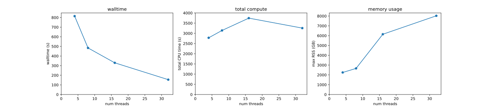

---
title: Sourmash Branchwater Enables Lightweight Petabyte-Scale Sequence Search
keywords:
- sourmash
lang: en-US
date-meta: '2022-10-30'
author-meta:
- Luiz Irber
- N. Tessa Pierce-Ward
- C. Titus Brown
header-includes: |-
  <!--
  Manubot generated metadata rendered from header-includes-template.html.
  Suggest improvements at https://github.com/manubot/manubot/blob/main/manubot/process/header-includes-template.html
  -->
  <meta name="dc.format" content="text/html" />
  <meta name="dc.title" content="Sourmash Branchwater Enables Lightweight Petabyte-Scale Sequence Search" />
  <meta name="citation_title" content="Sourmash Branchwater Enables Lightweight Petabyte-Scale Sequence Search" />
  <meta property="og:title" content="Sourmash Branchwater Enables Lightweight Petabyte-Scale Sequence Search" />
  <meta property="twitter:title" content="Sourmash Branchwater Enables Lightweight Petabyte-Scale Sequence Search" />
  <meta name="dc.date" content="2022-10-30" />
  <meta name="citation_publication_date" content="2022-10-30" />
  <meta name="dc.language" content="en-US" />
  <meta name="citation_language" content="en-US" />
  <meta name="dc.relation.ispartof" content="Manubot" />
  <meta name="dc.publisher" content="Manubot" />
  <meta name="citation_journal_title" content="Manubot" />
  <meta name="citation_technical_report_institution" content="Manubot" />
  <meta name="citation_author" content="Luiz Irber" />
  <meta name="citation_author_institution" content="Graduate Group in Computer Science, UC Davis" />
  <meta name="citation_author_institution" content="Department of Population Health and Reproduction, UC Davis" />
  <meta name="citation_author_orcid" content="0000-0003-4371-9659" />
  <meta name="twitter:creator" content="@luizirber" />
  <meta name="citation_author" content="N. Tessa Pierce-Ward" />
  <meta name="citation_author_institution" content="Department of Population Health and Reproduction, UC Davis" />
  <meta name="citation_author_orcid" content="0000-0002-2942-5331" />
  <meta name="twitter:creator" content="@saltyscientist" />
  <meta name="citation_author" content="C. Titus Brown" />
  <meta name="citation_author_institution" content="Department of Population Health and Reproduction, UC Davis" />
  <meta name="citation_author_orcid" content="0000-0001-6001-2677" />
  <link rel="canonical" href="https://dib-lab.github.io/2022-paper-branchwater-software/" />
  <meta property="og:url" content="https://dib-lab.github.io/2022-paper-branchwater-software/" />
  <meta property="twitter:url" content="https://dib-lab.github.io/2022-paper-branchwater-software/" />
  <meta name="citation_fulltext_html_url" content="https://dib-lab.github.io/2022-paper-branchwater-software/" />
  <meta name="citation_pdf_url" content="https://dib-lab.github.io/2022-paper-branchwater-software/manuscript.pdf" />
  <link rel="alternate" type="application/pdf" href="https://dib-lab.github.io/2022-paper-branchwater-software/manuscript.pdf" />
  <link rel="alternate" type="text/html" href="https://dib-lab.github.io/2022-paper-branchwater-software/v/8783f70c033276e095324eb65ce9e4ab99fc5963/" />
  <meta name="manubot_html_url_versioned" content="https://dib-lab.github.io/2022-paper-branchwater-software/v/8783f70c033276e095324eb65ce9e4ab99fc5963/" />
  <meta name="manubot_pdf_url_versioned" content="https://dib-lab.github.io/2022-paper-branchwater-software/v/8783f70c033276e095324eb65ce9e4ab99fc5963/manuscript.pdf" />
  <meta property="og:type" content="article" />
  <meta property="twitter:card" content="summary_large_image" />
  <link rel="icon" type="image/png" sizes="192x192" href="https://manubot.org/favicon-192x192.png" />
  <link rel="mask-icon" href="https://manubot.org/safari-pinned-tab.svg" color="#ad1457" />
  <meta name="theme-color" content="#ad1457" />
  <!-- end Manubot generated metadata -->
bibliography:
- content/manual-references.json
manubot-output-bibliography: output/references.json
manubot-output-citekeys: output/citations.tsv
manubot-requests-cache-path: ci/cache/requests-cache
manubot-clear-requests-cache: false
...

<small><em>
This manuscript
([permalink](https://dib-lab.github.io/2022-paper-branchwater-software/v/8783f70c033276e095324eb65ce9e4ab99fc5963/))
was automatically generated
from [dib-lab/2022-paper-branchwater-software@8783f70](https://github.com/dib-lab/2022-paper-branchwater-software/tree/8783f70c033276e095324eb65ce9e4ab99fc5963)
on October 30, 2022.
</em></small>

## Authors

+ **Luiz Irber**
   
    {.inline_icon width=16 height=16}
    [0000-0003-4371-9659](https://orcid.org/0000-0003-4371-9659)
    · {.inline_icon width=16 height=16}
    [luizirber](https://github.com/luizirber)
    · {.inline_icon width=16 height=16}
    [luizirber](https://twitter.com/luizirber) 
  <small>
     Graduate Group in Computer Science, UC Davis; Department of Population Health and Reproduction, UC Davis
     · Funded by Grant GBMF4551 from the Gordon and Betty Moore Foundation; Grant R01HG007513 from the NIH NHGRI
  </small>

+ **N. Tessa Pierce-Ward**
   
    {.inline_icon width=16 height=16}
    [0000-0002-2942-5331](https://orcid.org/0000-0002-2942-5331)
    · {.inline_icon width=16 height=16}
    [bluegenes](https://github.com/bluegenes)
    · {.inline_icon width=16 height=16}
    [saltyscientist](https://twitter.com/saltyscientist) 
  <small>
     Department of Population Health and Reproduction, UC Davis
     · Funded by Grant 1711984 from the NSF; Grant GBMF4551 from the Gordon and Betty Moore Foundation; Grant 2018911 from the NSF
  </small>

+ **C. Titus Brown**
   
    {.inline_icon width=16 height=16}
    [0000-0001-6001-2677](https://orcid.org/0000-0001-6001-2677)
    · {.inline_icon width=16 height=16}
    [ctb](https://github.com/ctb) 
  <small>
     Department of Population Health and Reproduction, UC Davis
     · Funded by Grant GBMF4551 from the Gordon and Betty Moore Foundation; Grant R01HG007513 from the NIH NHGRI; Grant 2018911 from the NSF; Grant R03OD030596 from the NIH Common Fund
  </small>

::: {#correspondence}
✉ — Correspondence possible via [GitHub Issues](https://github.com/dib-lab/2022-paper-branchwater-software/issues)

:::

## Abstract {.page_break_before}

We introduce branchwater, a flexible and fast petabase-scale search
for the 800,000 public metagenomes presently in the NCBI Sequence Read
Archive. Our search is based on the FracMinHash k-mer sketching
technique and can search all public metagenomes with 1000 query
genomes in approximately 24 hours using 30 GB of RAM and 32 threads.
Branchwater is a Rust-based multithreading front-end built on top of
the sourmash library. We provide biological use cases, discuss design
and performance considerations, and provide benchmarks for a variety of
different parameters.

## Introduction {.page_break_before}

<!-- *The Introduction should provide context as to why the software tool was developed and what need it addresses. It is good scholarly practice to mention previously developed tools that address similar needs, and why the current tool is needed.* -->

Substantial growth in publicly available nucleotide sequencing data
(DNA and RNA) has occurred over the last decade, driven by decreases
in sequencing costs.  In particular the Sequence Read Archive now has
over 9 million entries containing 12 PB of data [@sra].  Shotgun
metagenomes, generated by random sequencing of mixtures of microbes
sampled from a microbiome are a particularly interesting resource
stored in the SRA].

Shotgun metagenome data sets are often large (100s of MBs to 10s of
GB) and can be highly complex, with environmental samples containing
genomic data that can be attributed to thousands or more species.  In
the past decade, hundreds of thousands of new bacterial and archaeal
genomes have been isolated from public metagenomes, and several
entirely new branches of life have been discovered (large
bacteriophage, hug et al, etc.)

Beyond their initial use, these data sets form an incredibly rich
resource for contextualizing novel sequencing data and for synthesis
research on a myriad of large-scale genomic questions ranging from
basic evolutionary processes to disease associations and pathogenicity
tracking (Table X).
However, comprehensive discovery of relevant data sets is challenging.
Metadata for these data sets is typically geared towards the
submitting researcher's major findings and study questions, and moreover cannot
possibly describe the full contents of the data.
Furthermore, metadata provided at the time of submission can be
incomplete or inconsistent, rendering systematic data set discovery
intractable.

Content-based search is a promising alternative strategy to finding
data sets in archives.  By searching with genomic content of interest,
content-based search can recover datasets containing relevant species
or genes of interest regardless of their associated metadata.
However, search of unassembled sequence is critical to ensure unbiased
and comprehensive recovery of relevant datasets.  Assembly techniques
are designed to produce consensus reference sequences useful for
consistent comparisons across genotypes, often collapsing sequence
variation in the process.  In addition, reassembly and reanalysis of
existing data using different parameters or newer methods often yields
different results.  Content-based search of unassembled metagenomes
can bypass these issues and facilitate consistent downstream analysis
across data sets that may have been initially generated to answer a
range of disparate biological questions, and been first analyzed over
a range of years and with myriad techniques.

A number of approaches have been developed to enable content-based
search of single-organism genomic and RNAseq data.  Methods that
enable rapid, large-scale search across hundreds of thousands of data
sets typically leverage biological sketching techniques and
probabilistic data structures to reduce the effective search space
[@sbt; @bigsi; @ssbt].  However, these approaches do not readily
translate to datasets with unknown levels of sequence diversity, the
defining feature of metagenomic datasets.

Recent extensive search across viral datasets ... comprehensive but
time-consuming and costly, intractable for independent researchers
[@serratus]. Also ref searchsra [@searchsra], PARTIE [@partie],
etc. STAT [@stat], Metagraph, [@metagraph], BIGSI [@bigsi].

Below, we introduce Branchwater, an SRA-scale querying system that
uses containment searches based on FracMinHash sketching to search all
public metagenome data sets in the SRA in approximately 24 hours on
commodity hardware with 1-1000 query genomes. Branchwater uses the
Rust library underlying the sourmash implementation of FracMinHash to
execute massively parallel searches of a presketched digest of the
SRA [@sourmash_joss; @gather].

The availability of relatively lightweight content-based search of SRA
metagenomes addresses many biological use cases (Table @tbl:bio-use-cases).
Some of these use cases have already been explored with Branchwater:
Viehweger et al. used Branchwater to discover a metagenomic sample
containing *Klebsiella pneumonia* that was subsequently included in an
outbreak analysis, and Lumian et al. (2022) conducted a
biogeographical study on five newly generated cyanobacterial genomes
from Antarctic samples [@viehweger; @lumian_biogeo].

Thoughts and questions:

* For discussion: content-based search, including MAGs and things
  without marker genes.
* stress lightweight resource usage
* note that a key requirement of Branchwater was that we search unassembled.
* discuss thresholds ...somewhere.

----

| Use case | Description | Enabled by branchwater |
| -------- | -------- | -------- |
| Biogeography of genomes     | Describe and characterize biogeographical distribution of species; identify sampling locations     | Yes     |
| Outbreak tracking | Trace pathogen spread via public data | Yes, for genomes > 10kb |
| Pangenome expansion | Expand and explore composition of strains, species and genus levele pangenomes (including SAGs and MAGs) | Yes |
| SRA metadata reannotation | Content-based validation and reannotation of SRA metagenomes | Yes |
| Private database access and search | Provide privacy-enabled search of large, access-restricted databases | Yes |
| Post-processing and cleaning MAGs | Evaluating contig-level presence and abundance across multiple metagenomes | Yes, for contigs > 10kb |
| Exploring breadth of plasmids etc. | Evaluating range and prevalence of laterally transferred genomic elements | Yes, for plasmids > 10b |
| Exploring host range of species for regulatory evaluation | | Yes, for genomes > 10kb |
| Search for small viruses | | No |
| Searching for specific functional genes | | No |
| Detecting novel classes and orders | |  No |

Table: Biological use cases for petabase scale sequence search of metagenomes {#tbl:bio-use-cases}

NOTE: Small viral pangenome query comment/Luiz. Association studies?

edit table [here](https://hackmd.io/Pgj6AjM_RlGF0_7rGhY3tA)

## Background: FracMinHash and sourmash {.page_break_before}

FracMinHash is a bottom-sketch version of ModHash that supports
accurate estimation of overlap and containment between two sequencing
sets [@gather]. In brief, FracMinHash is a lossy compression approach
that represents data sets using a "fractional" sketch containing 1/S
of the original k-mers.  Sketches support estimation of overlap,
bidirectional containment, and Jaccard similarity between two data
sets. Unlike other common sketching techniques such as MinHash [@mash]
and HyperLogLog [@dashing], FracMinHash supports these operations
between two data sets of different sizes, and unlike mash screen and
CMash does not require the original data sets [@mash_screen; @cmash].
In exchange, FracMinHash sketches are essentially unbounded in size.

The open-source sourmash software provides a mature and
well-documented command-line interface to FracMinHash, along with
Python and Rust APIs for loading and using FracMinHash sketches
[@sourmash_joss; @sourmash_f1000]. The Python layer provides a larger
number of user experience conveniences on top of the performant Rust
layer. However, despite the thread safety of the underlying Rust code,
the CLI and Python library still operate in single-threaded mode,
which limits the utility of sourmash for very large scale
operations. Refactoring the sourmash CLI and Python libraries to take
advantage of thread safety is a substantial and ongoing effort; we
chose here to develop a dedicated CLI in Rust instead.

There are several features of FracMinHash and sourmash that limit
their utility for specific use cases. In particular, the default
scaled parameters used in sourmash do not work well for comparing or
detecting genomes smaller than 10kb in size. Nor can divergent genomes
be found; based on k-mer containment to ANI conversion
[@dk_fracminhash], we find that sourmash works well for finding
matches to genomes within about 90% ANI of the query, but not
further. Finally, FracMinHash was developed for shotgun data sets and
different parameters would be required for targeted sequencing data
such as amplicon data sets.  Some of these limitations are intrinsic
to FracMinHash, and others may be overcome in the future by parameter
tuning and further research.

### Petabase scale search represents a specific technical challenge to sourmash

The primary design focus for the sourmash CLI has been on searching
and comparing many genome-sized sketches, where for
typical parameters there are between 1000 and 10,000 hashes in each sketch. The
software provides a variety of in-memory and on-disk data structures
for organizing sketches in this size range and can search hundreds of
thousands of genome sketches with a single query in minutes in a
single thread on an SSD laptop; more complex algorithms such as the
min-set-cov described in [@gather] can take a few hours but are still
acceptably performant on real-world data.

Branchwater faces very different challenges in searching 800,000
metagenomes.  Many of these data sets are extremely large, slow to
read from disk, and individually require substantial memory to load.
Multiple queries may be used to search each metagenome as well, incurring
quadratic search costs.

One solution we tried initially was a scatter-gather approach based on
a cluster-aware workflow engine (in this case, snakemake
[@snakemake]). The overhead on workflow coordination and executing
shell commands was prohibitive for our initial implementation, so we
pursued a purpose-built multithreaded solution instead.

## Methods {.page_break_before}

<!-- *The Methods should include a subsection on Implementation describing
 how the tool works and any relevant technical details required for
 implementation; and a subsection on Operation, which should include
 the minimal system requirements needed to run the software and an
 overview of the workflow.* -->
 
### Sketching the Sequence Read Archive

We determined the accessions of all publicly available shotgun
metagenomic via the query string `"METAGENOMIC"[Source] NOT
amplicon[All Fields]` at the NCBI Sequence Read Archive Web site,
https://www.ncbi.nlm.nih.gov/sra.  We then downloaded all runs for all
accessions and streamed them into `sourmash sketch dna` with
parameters `-p k=21,31,51,scaled=1000,abund`. The resulting sourmash
signature files were saved as individual gzipped JSON files (each
containing 3 sketches), one file for each input run.

The resulting catalog contains 767,277 metagenome data sets as of
March 2022, with the majority annotated human-associated microbiomes
(Table @tbl:sra-types). The size of all sketches together is 7.5 TB,
containing approximately 375 billion hashes per k-mer size,
representing 375 trillion k-mers from ZZZ PB of original files. The
average sketch file size is 9.7 MB, and the median is 570kb. The
largest 10,000 data sets comprise 30% of the total sketch sizes.

| "Scientific Name" provided by submitter | distinct data sets | 
| --- | --- |
| human gut metagenome  |   162187 |
| metagenome              |   57048
| gut metagenome           | 47244
| human metagenome         | 36438
| soil metagenome          | 35323
| mouse gut metagenome     | 26482
| human skin metagenome    | 25700
| Homo sapiens             | 21020
| marine metagenome        |14400
| human oral metagenome    |  14235

Table: The 10 largest categories of metagenome data set types in the Sequence
Read Archive, as of March 2022. {#tbl:sra-types}

### Implementation of multithreaded search

<!-- CTB: rename program to branchwater? -->

The `sra_search` program is built in Rust on top of the sourmash
library for loading and comparing sketches. It implements the
following steps:

1. Loads all query sketches into memory from a list of files.
2. Loads the list of filenames containing subject sketches to search.
3. In a Rust closure function executed in parallel for each subject sketch filename,
   a. loads the subject sketch from the file;
   b. for each query, determines the estimated overlap between query and subject;
   c. reports overlaps above a user-specified threshold.
   d. releases all per-metagenome resources

Downsampling of sketches to higher scaled values is performed
dynamically, after load (if requested). Results are reported back to a
separate "writer" thread via a threadsafe multi-producer,
single-consumer FIFO queue. We use the rayon `par_iter` function to
execute the closures in parallel.

This approach leverages the core features of sourmash to efficiently
keep queries in memory and batch-process metagenome sketches without
storing them all in memory. The approach also takes advantage of the
effective immutability of queries, which can be shared without
data races by multiple processing threads.

### Executing sra_search at the command line

`sra_search` takes in search parameters as well as two text files, one
containing a list of query file paths and one containing a list of
subject file paths. Upon execution, it reports the number of query
sketches loaded and the number of subject file paths found, and then
begins the search. It progressively reports the number of sketches
searched in blocks of 10000, and outputs matches to a CSV File.

We typically run `sra_search` in a snakemake workflow, which manages
environment variables and input/output files.

### Performance and scaling analysis

`sra_search` scales linearly in memory and time with queries and # threads.

A variety of simple benchmarks will presumably show:

* Do a benchmark of a complete query against all.
* What happens w/biggest sketches? Much slower.
* Complexity is n(query) \* n(subject), with subject loading being the
  dominant practical time. More complex indexing and query foo could
  be done but it’s fast enough and the code is simple.

`sra_search` is largely I/O bound, with substantial input
requirements; this is particularly clear from the YYY% slowdown from
loading the 10,000 biggest sketches. 

| metric | observed | 
| -------- | -------- | 
| time     | 24.2 +/- 1.7 min |
| max RSS | 16.4 +/-  1.6 GB |
| I/O in | 93.4 +/- 1.9  |

Table: Time, memory, and I/O input for 5 runs of 1000 queries against 10,000 metagenomes. Queries were randomly selected from 318k genomes in GTDB rs207. Metagenomes were randomly selected from the full catalog of 767k.

{#fig:basic_bench}

CTB: should note that one thread is used exclusively for writing to CSV.

See https://github.com/dib-lab/2022-branchwater-benchmarking for
numbers and notebook.

{#fig:basic_scaling}

### Post-search validation

The sourmash CLI can be used to explore k-mer matches for individual
data sets. This does not validate the matches beyond confirming the
containment numbers, although sourmash provides additional information
(e.g. estimated abundances) on top of the minimial information
provided by branchwater.  FracMinHash generally and Branchwater
specifically have been validated bioinformatically primarily by
mapping reads (see [@gather; @lumian_biogeo]). This is discussed
further below.

### Sra_search is inexpensive and supports exploratory queries

CTB: Estimate cost of a run. Compare to serratus - cloud compute, data
download. Serratus is probably cheaper than $20k now but still
expensive.

## Discussion {.page_break_before}

Discuss sens/spec of k-mer search.

Making large collections of sequencing data easy to search by content
is an open problem, and approaches that work for smaller collections
rarely scale well, even for current database sizes. New methods that
take advantage of specific particularities of the query and desired
answer can help bridge the gap between more general methods by
allowing filtering large databases, resulting in more manageable
subsets that can be used efficiently with current methods.
FracMinHash sketches allow calculating similarity and containment
between datasets with-out the need to access the original
datasets. Because only a fraction of the original data need to be
stored, they are good basic components in the implementation of
systems that allow searching large collections of datasets.

This has been used in two papers so far - Lumian et al, Viehweger et
al. [@viehweger]. Viehweger et al. [@viehweger] used branchwater to
find a metagenome containing an additional *Klebsiella pneumoniae* for
a large scale analysis of outbreak data, while Lumian et al. conducted
a global biogeography analysis of five new antarctic cyanobacteria.

We expect more use cases, and more elaborate use cases, to emerge over
the next few years. The low cost of search is particularly enabling
for exploratory efforts, although the sheer size of the underlying
data needed for branchwater continues to present obstacles. We are
currently focusing on realtime API access to search methods.

There are several scientific limitations to overcome as well. The
current search approach has limited sensitivity to divergent sequence
beyond the genus level, and cannot find smaller matches. These are
topics for future research and development.

### Following up on Branchwater results

Many Branchwater use cases are intended for early-stage hypothesis
generation and refinement, i.e. branchwater implements the first part
of a “hit to lead” pipeline. Hence Branchwater operates at an early
stage in conceptual and concrete workflows. The initial steps
immediately after executing Branchwater are (1) choosing a threshold
at which to filter results, (2) evaluating the overall results by type
of metagenome retrieved, and (3) retrieving the data underlying the
matches.

The first analysis step taken is typically picking a more stringent
threshold. The default Branchwater threshold is set to 0.01
containment - any metagenome that contains more than 1% of the k-mers
in any query is reported. This is done because searches are exhaustive
- every query is searched against every subject - and so there is no extra
cost beyond the minimal space required to save the results.

Thresholds are typically chosen based on the use case and the expected
distribution of the annotated metagenome type (`ScientificName` from
the SRA Runinfo database). We have provided a simple script that
imports the SRA metadata and summarizes the Branchwater results at the
provided threshold (example output).

After filtering, many paths can be taken. A plethora of general
purpose bioinformatics tools exist for working with the data from
individual metagenomes.

We have built two custom tools in concert with sourmash and
Branchwater, genome-grist and spacegraphcats.  Genome-grist performs
an entirely automated reference-based characterization of individual
metagenomes that combines sourmash gather / minimum metagenome cover
with mapping; it is described in Irber et al. [@gather] and was used
in Lumian et al. [@lumian_biogeo]. Given that it does download all the
data and maps all the reads, it is still relatively lightweight.

spacegraphcats is an assembly-graph based investigative tool for
metagenomes that retrieves graph neighborhoods from metagenome
assembly graphs for the purpose of investigating strain variation
[@spacegraphcats]. It was used to retrieve putative accessory elements
from sourmash matches in Reiter et al. [@reiter_ibd] and Lumian et
al. [@lumian_phormidium]. It is much heavier weight than genome-grist
because it relies on a compact De Bruijn graph, which is expensive to
build for very rich or diverse metagenomes.

### Design alternatives

Brancwhater is a simple and effective implementation that is easy to
analyze algorithmically and supports a number of use cases. However,
many improvements are possible: FracMinHash analyses are based on
comparing collections of 64-bit integers, and there are many effective
tools and approaches for organizing and searching such collections
more efficiently than is presently done in Branchwater.

One area for particular improvement is storing and loading sketches
more efficiently. The current JSON-based format is convenient for
debugging and multi-language interoperability but is extremely
inefficient, to put it mildly. Moreover, each file currently contains
three k-mer sketches (one per k-mer size), which means approximately 3
times as much data is loaded per query than is actually used.
FracMinHash also could support fractional loading, i.e. decreased
resolution by loading only the bottom portion of the sketch; this
would enable must faster searches albeit at lower resolution. This is
not yet supported by the underlying sourmash library.

Currently the data files are organized as flat files in a single
directory on a single network file system. There are a variety of
practical ways to speed up the search by distributing sketch files
across multiple nodes, but this is logistically challenging. In
particular, our typical usage involves running branchwater once every
few weeks on our HPC, which does not have sufficient local storage to
distribute the data sets. In addition, the speed savings from
distributing sketches across nodes is unlikely to be rewarding enough
to offset the maintenance requirements for a distributed collection of
13 TB of sketches.  Future work could include implementation of an
automated distribution system, although careful evaluation of the
maintenance and update requirements would be needed.

We could also create a simple pre-filter for each file using a data
structure with one-sided error. For example, we could create a Bloom
filter for each sketch that could be used to estimate containment
prior to loading the full sketch file. However, for some potentially
common use cases such as queries with many matches, this could add
significant I/O without speeding up the actual search.

Building an inverted index that maps hashes to data sets could also
enable rapid queries. Two challenges here are the scale of the catalog
and the number of data sets; the total number of hashes present in our
metagenome catalog is XYZ, across nearly 800,000 data sets.

Despite these many opportunities for optimization, we note that there
is a significant benefit to the simplicit of our current approach. In
particular, providing the sketches in individual files organized by
accession makes it straightforward to access individual sketches by a
distinct ID and quickly update the overall metagenome catalog.  This
is particularly valuable since the sourmash Python package provides a
flexible suite of tools for inspecting and manipulating individual
metagenome sketches.  The lack of auxiliary data structures also
avoids expensive load and synchronization steps when adding new
datasets. These features are important for downstream user
investigation as well as maintainability and correctness, which are
important considerations in any scientific software workflow.

## Conclusion {.page_break_before}

We provide a flexible and fast petabase-scale search based on
FracMinHash, together with some simple downstream summarization tools
and an increasingly mature (but much slower) investigative ecosystem.
This supports and enables a wide range of interesting use cases that
take advantage of public data; these use cases range from biomedical
to ecological to technical (Table @tbl:bio-use-cases).

## Data availability statement:

All of the original data underlying the Branchwater database is
available from the NCBI Sequence Read Archive. A current catalog of
the SRA accessions is provided (here). The sketch collection is 7 TB
and is available upon request.  All sketches are provided under
Creative Commons Zero (CC0) - No Rights Reserved.

[@bigsi]: doi:10.1038/s41587-018-0010-1

[@sbt]: doi:10.1038/nbt.3442

[@ssbt]: doi:10.1089/cmb.2017.0265

[@serratus]: doi:10.1038/s41586-021-04332-2

[@gather]: doi:10.1101/2022.01.11.475838 

[@dashing]: doi:10.1186/s13059-019-1875-0

[@mash]: doi:10.1186/s13059-016-0997-x

[@dk_fracminhash]: doi:10.1101/2022.01.11.475870

[@mash_screen]: doi:10.1186/s13059-019-1841-x

[@sourmash_joss]: doi:10.21105/joss.00027

[@sourmash_f1000]: doi:10.12688/f1000research.19675.1

[@cmash]: doi:10.1101/184150

[@snakemake]: doi:10.12688/f1000research.29032.2

[@viehweger]: doi:10.1099/mgen.0.000741

[@spacegraphcats]: doi:10.1186/s13059-020-02066-4

[@lumian_phormidium]: doi:10.3390/genes12030426

[@lumian_biogeo]: doi:10.1101/2022.10.27.514113 

[@reiter_ibd]: doi:10.1101/2022.06.30.498290

[@metagraph]: doi:10.1101/2020.10.01.322164

[@stat]: doi:10.1186/s13059-021-02490-0

[@partie]: doi:10.1093/bioinformatics/btx184

[@searchsra]: url:https://www.searchsra.org/

[@sra]: doi:10.1093/nar/gkq1019

## References {.page_break_before}

<!-- Explicitly insert bibliography here -->

